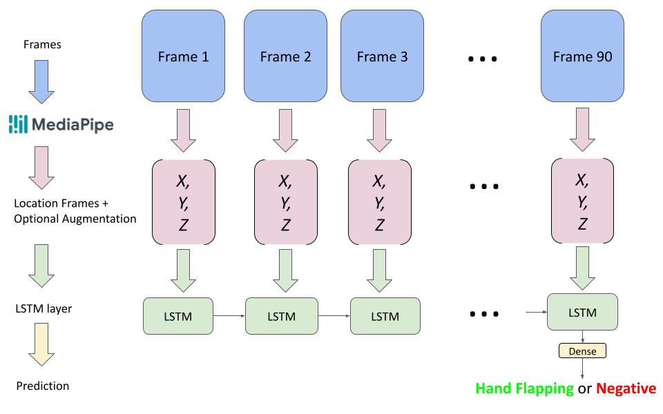

<link rel = "stylesheet" type="readme.css">
<h1 id="activity-recognition-for-autism-detection">Activity Recognition for Autism Detection</h1>

Code for <strong>Activity Recognition for Autism Detection</strong>.

<strong><a href="mailto:anish.lakkapragada@gmail.com,peter100@stanford.edu,dpwall@stanford.edu">Authors</a></strong>: <a href="mailto:anish.lakkapragada@gmail.com">Anish Lakkapragada</a>, <a href="mailto:peter100@stanford.edu">Peter Washington</a>, <a href="mailto:dpwall@stanford.edu">Dennis P. Wall</a>

   
Abstract

   insert final abstract here 

<h2 id="objective">Objective</h2>

Today&#39;s autism diagnosis is a quite lengthy and inefficient process. Families often have to wait a few years before receiving a diagnosis, and this problem is exacerbated by the fact that the earliest possible intervention is required for best clinical outcomes. One of the biggest indicators of autism is self-stimulatory, or stimming, behaviors such as hand flapping, headbanging, and spinning. In this paper, we demonstrate successful lightweight detection of hand flapping in videos using deep learning and activity recognition. We believe such methods will help create a remote, fast, and accessible autism diagnosis. 

<h2 id="data">Data</h2>

In order to collect the videos, we use the <a href="https://rolandgoecke.net/research/datasets/ssbd/">Self-Stimulatory Behavior Dataset (SSBD)</a> which contains 75 videos of hand flapping, head banging, and spinning behavior. We extract 100 hand flapping and control 2-3 second videos from this dataset and use it 
   to train our model. Because most of the videos in SSBD are children, we wanted to see whether a model we built could generalize past age (and hand shape), so we recorded 3 positive and 3 control videos of ourselves. 

Our entire dataset can be found in a google drive folder <a href="https://tinyurl.com/47fya6">here</a>.

<h2 id="approach">Approach</h2>

In this space, one way to detect hand flapping in videos that has been done before is to use pose estimation images and feed them into time-series based 
   Recurrent Neural Networks (RNNs). However because these approaches use heavier feature representations, they demand heavier models; this is not ideal for creating models to deploy into mobile phones, etc. We decide to use a much lighter feature representation and model by using landmark detection to find the
   coordinates of the detected hand landmarks as a feature representation over time which is then fed into a Long-Short Term Memory (LSTM) network. 

The above image shows the 21 landmarks that Mediapipe, a landmark detection framework made by Google, recognizes on the hands. We take the first 90 frames of a video, and at each frame,  take the detected <em> (x, y, z) </em> coordinates of a set amount of landmarks and concatenate them to become a &quot;location frame&quot;. Note that the location frame is always 6x bigger than the set amount of landmarks, because there are 3 coordinates for a given landmark and 2 hands where that landmark can be found. If a landmark is not detected, we set all of its <em> (x, y, z) </em> coordinates to 0. This location vector for every frame is fed into an LSTM network that then gives us our prediction. We train models with and without augmentation and compare their results. Our overall approach is shown in the below image. 

It is easy to see that this kind of feature representation and model architecture would easily fit into a model device even unoptimized. Our heaviest model uses &lt;50,000 parameters. 

<h2 id="approaches">Approaches</h2>

We tried multiple approaches to create the best model. Our first approach was the most simple - we just used all the 21 landmarks MediaPipe detects to create the location frames. However, we wondered whether this would make the model overfit to the small hands present in the dataset. So to eliminate hand shape, we tried a one landmark approach where we only used the 0th landmark in the location frames. Because of the shakiness in the videos of our dataset, we decided it may not be wise to depend on only one landmark, so we tried a "mean landmark" approach where we took the mean of the <em> (x, y, z) </em> coordinates of all detected landmarks for each frame. This mean coordinate of all detected coordinates would be used frame by frame in this approach. The last approach was to use six landmarks found on the edge of the hands, numbered 0, 4, 8, 12, 16, and 20. 

<h2 id="results">Results</h2>

We found that the best results on our recorded videos and on our dataset came from using the six landmarks approach. Explanations for why this happened are described in the Discussion section of our paper. This approach almost always predicted correctly on our self-recorded videos and got a good, consistent accuracy on our dataset. It&#39;s (validation) accuracy, precision, recall, F1 Score, and AUROC over 10 runs are shown below.

<table>
   <thead>
      <tr>
         <th>Accuracy</th>
         <th>Precision</th>
         <th>Recall</th>
         <th>F1 Score</th>
         <th>AUROC</th>
      </tr>
   </thead>
   <tbody>
      <tr>
         <td>71.9 ± 1.7</td>
         <td>70.8 ± 1.85</td>
         <td>74.5 ± 4.04</td>
         <td>71.9 ± 2.25</td>
         <td>0.77 ± 0.03</td>
      </tr>
   </tbody>
</table>

   
 All Results 

   
 If you are interested, we show the results of all the approaches we tried (trained without augmentation) below. 

   <table class = "hideextra" style=display.inline-table>
      <thead>
         <tr>
            <th>Approach</th>
            <th>Classification Accuracy</th>
            <th>Precision</th>
            <th>Recall</th>
            <th>F1 Score</th>
            <th>AUROC</th>
            <th>Video Performance</th>
         </tr>
      </thead>
      <tbody>
         <tr>
            <td>All Landmarks</td>
            <td>72.4 ± 0.8</td>
            <td>69.68 ± 0.99</td>
            <td>82.92 ± 0.94</td>
            <td>75.15 ± 0.57</td>
            <td>0.75 ± 0.02</td>
            <td>🤮</td>
         </tr>
         <tr>
            <td>Mean Landmark</td>
            <td>69.8 ± 4.04</td>
            <td>69.18 ± 5.05</td>
            <td>69.78 ± 6.56</td>
            <td>67.86 ± 3.52</td>
            <td>0.75 ± 0.02</td>
            <td>😐</td>
         </tr>
         <tr>
            
            <td>One Landmark</td>
            <td>73.9 ± 2.77</td>
            <td>75.29 ± 1.72</td>
            <td>73.1 ± 5.09</td>
            <td>72.6 ± 2.30</td>
            <td>0.77 ± 0.02</td>
            <td>👍</td>
            
         </tr>
         <tr>
            <td>Six Landmark</td>
            <td>71.9 ± 1.7</td>
            <td>70.8 ± 1.85</td>
            <td>74.5 ± 4.04</td>
            <td>71.9 ± 2.25</td>
            <td>0.77 ± 0.03</td>
            <td>🔥</td>
         </tr>
      </tbody>
   </table>

